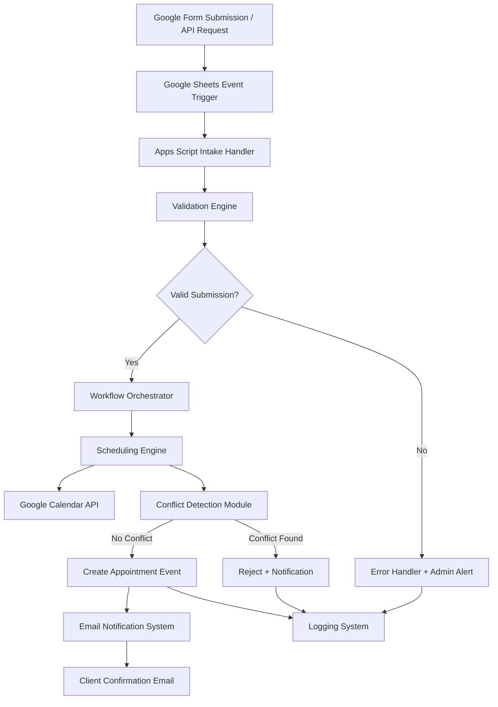

# Architecture — Intake Automation Workflow Orchestration System

## 🧠 System Overview

This system is a workflow orchestration engine that processes intake submissions, validates structured data, applies business rules, and triggers downstream scheduling actions.

It follows an event-driven architecture with a centralized workflow decision layer.

---

## 🏗 AWS-Style System Architecture

---

## ⚙️ Core Design Principles

- Event-driven execution model
- Stateless request processing where possible
- Centralized workflow orchestration layer
- Deterministic scheduling decisions
- Fail-safe validation before execution
