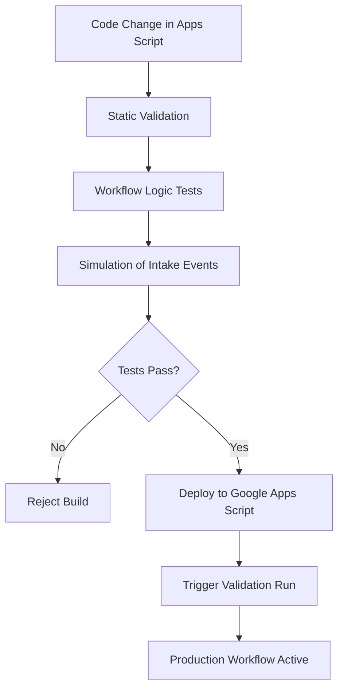

# CI/CD — Intake Automation System

## 🧠 Purpose

Defines safe deployment and execution strategy for workflow logic changes in a scheduling automation system.

---

## 🚀 CI/CD Pipeline (AWS-style)

---

## ⚙️ Key Principles

- No deployment without workflow validation
- Simulated intake requests before production rollout
- Safe rollback via script versioning
- Deterministic scheduling behavior across versions
