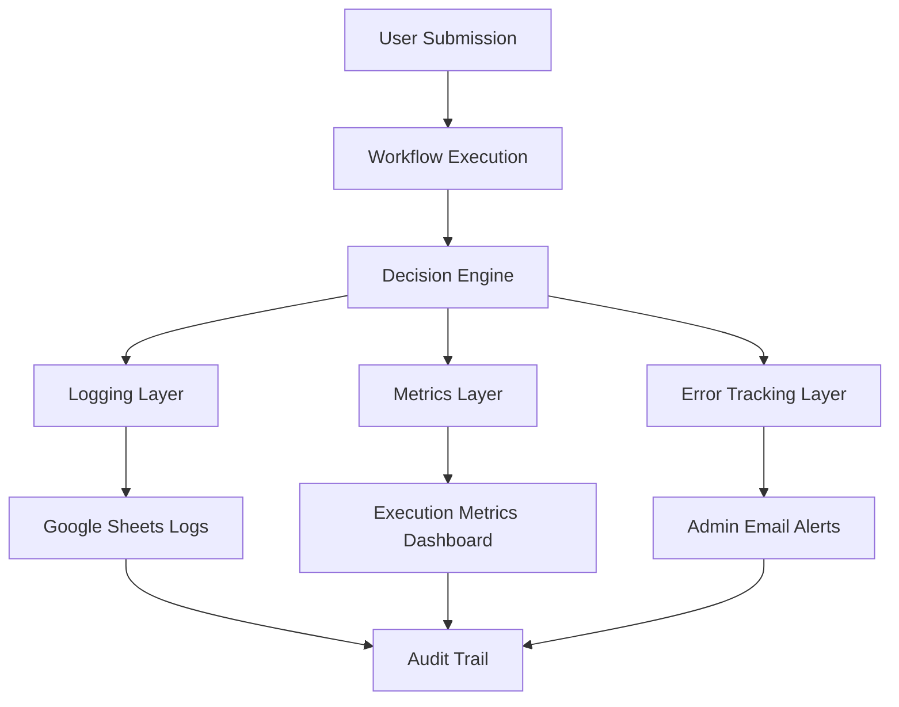

# Observability — Intake Automation System

## 🧠 Purpose

Provides visibility into workflow execution, scheduling decisions, and failure points across the intake pipeline.

---

## 📊 Observability Architecture



---

## 📈 Key Metrics

- Submission success rate
- Conflict detection rate
- Average scheduling time
- Email delivery success rate
- Workflow failure frequency

---

## 🧠 Debug Model

Every request is traceable:

```
Submission → Validation → Decision → Outcome → Notification
```
