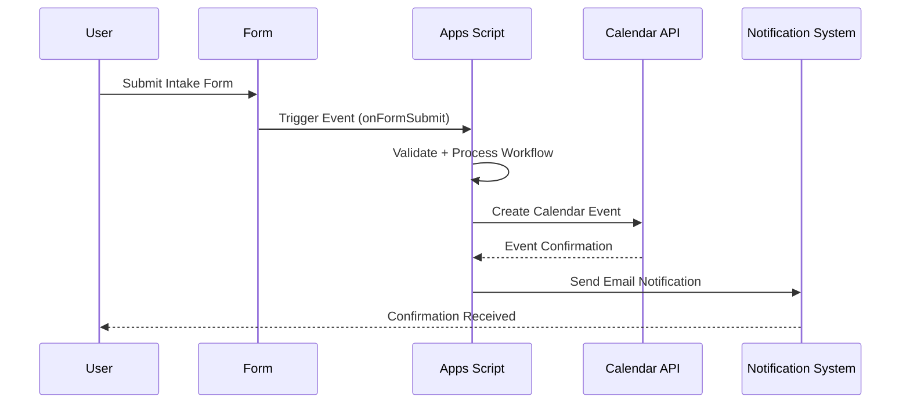

# Real-Time System — Intake Workflow

## 🧠 Purpose

Defines how scheduling updates propagate and remain consistent across users and systems.

---

## ⚡ Event Flow Architecture

---

## 🧩 Real-Time Behavior

- Near-instant intake processing
- Event-driven workflow execution
- Immediate feedback on scheduling outcome
- Synchronous calendar + email updates

---

## 🎯 Design Goal

Ensure users receive immediate confirmation of scheduling decisions with no manual delay.
