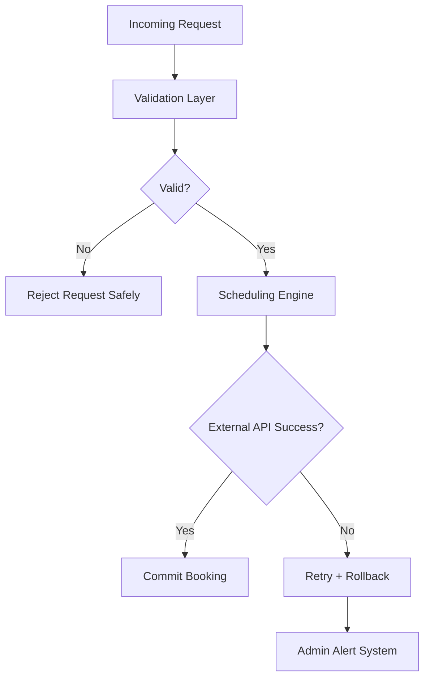

# Reliability — Workflow Scheduling System

## 🧠 Purpose

Ensures system correctness under failure, concurrency, and external API limitations (Google Calendar / Apps Script constraints).

---

## ⚙️ Reliability Model

---

## 🔒 Reliability Guarantees

- No partial bookings
- Atomic scheduling operations
- Safe failure recovery
- Retry logic for external APIs

---

## 🧠 Failure Philosophy

Every workflow must result in:

- SUCCESS → fully committed booking
OR
- FAILURE → clean rejection with no side effects
