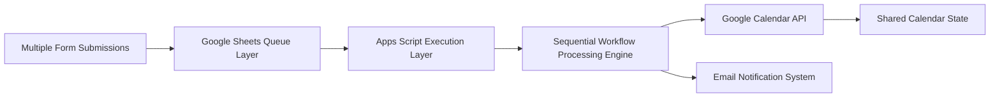

# Scaling — Intake Automation System

## 🧠 Purpose

Defines how the system behaves under increased intake volume and concurrent scheduling requests.

---

## 📊 Scaling Architecture

---

## ⚙️ Scaling Constraints

- Apps Script execution quotas
- Google Calendar API rate limits
- Sequential execution model (no true parallelism)

---

## 🧠 Scaling Strategy

- Queue-based processing via Google Sheets
- Idempotent scheduling logic
- Conflict-first validation reduces retry load
- Batch-safe email notification system

---

## 🚀 Scaling Behavior

System is optimized for:

- Small to medium organizational workflows
- High reliability over high throughput
- Deterministic scheduling correctness
